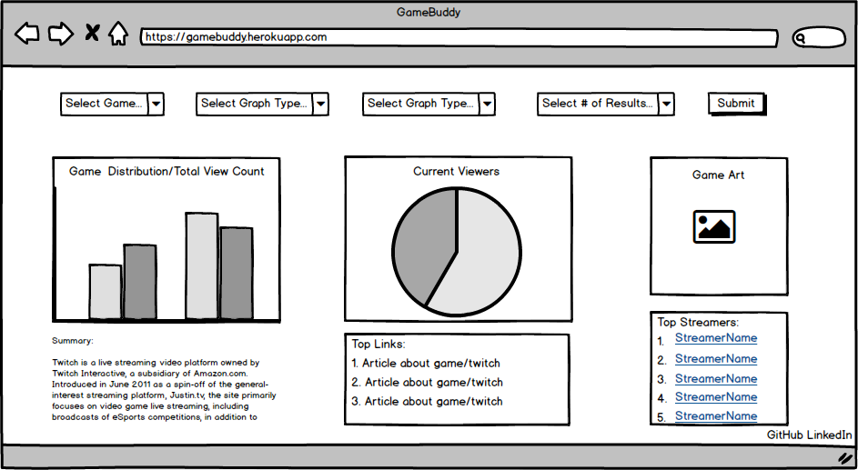

## GameBuddy - A Data Visualizer for Twitch.tv

### Background and Overview

GameBuddy is a data visualization tool that displays or gets real-time top streams, their games, and streamers.

Data will be displayed with different types of graphs to be able to compare stats about the games and their viewer counts.

Users will be able to see data distributions for up to 100 different streams.

Additionally, users will be able to:
* Change the amount of streams shown in order to read data better
* Change the game to look at a more specific distribution of that game instead

### Functionality & MVP  

In GameBuddy, users will be able to:
- [ ] See the top streams
- [ ] See the game distribution for the top streams/or the number of followers for the user
- [ ] See the viewer distribution for the accounts of the stream
- [ ] Specify whether to see the distribution of all streams, or of a specific game from the top streams
- [ ] Specify what kind of form they want to see the data in (doughnut graph, bar graph, bubble graph)

The Project, will also (hopefully) have:
- [ ] List of top 5 current news articles on twitch or a game depending on the search (Google Custom Search API)
- [ ] Summary of Twitch or the game searched for ()

### Wireframes

There will be options to change what you want to search for.

This app will be a on a single screen, showing the different graphs, games, and streamers.

There will be a list of the top 5 news articles on the topic.

There will be a summary of Twitch or the game searched for.

There will be links to my Github and LinkedIn.

### Architecture and Technologies

The project will be implemented with the following technologies:

- Vanilla JavaScript for overall structure and logic.

- D3.js for data visualization.

- Webpack to bundle and serve up the various scripts.

- Twitch API to get data for streams, games, and users.

- Another API maybe google trends to get recent data for news articles on games.

In addition to the webpack entry file, there will be three scripts involved in this project:

`main.js` this will hold the logic for populating the site's elements with data.

`graph.js` this will hold the logic for the graph data and manipulating it.

`api_util.js` this will hold all of the logic for the API calls needed.

### Implementation Timeline

**Over the weekend**:
- [ ] Set up API calls for Twitch.
- [ ] Learn about D3.js with tutorials and videos.

**Day 1**: Setup all necessary Node modules, including getting webpack up and running. Create `webpack.config.js` as well as `package.json`.  Write a basic entry file and the bare bones of all 3 scripts outlined above. Learn the basics of `D3.js`. Goals for the day:

- [ ] Get `webpack` serving files and frame out index.html
- [ ] Get API call data in the correct form in `graph.js`

**Day 2**: Dedicate this day to learning the `D3.js` API. Learn how to make a bar graph and a pie chart.

- [ ] Figure out how to display a bar graph with the data given
- [ ] Figure out how to display a pie chart with the data given
- [ ] Set hover effects on the charts to show what the data is about

**Day 3**: Finish learning up how to use `D3.js` and making the selects for the query.

- [ ] Figure out how to display a bubble graph with the data given with hover effects
- [ ] Create the selects for the query
- [ ] Have all the graphs showing up and arranged nicely

**Day 4**: Polish up the app to look good.

- [ ] Style to make it look nice
- [ ] Add use of API if possible to show relevant links (Google Custom Search API)
- [ ] Add use of another API to possibly get a summary of the game or twitch (MediaWiki API)

### Bonus features

- [ ] Summary of game
- [ ] Relevant links to game or twitch
- [ ] Getting the application to query continuously with no need for user submittal
